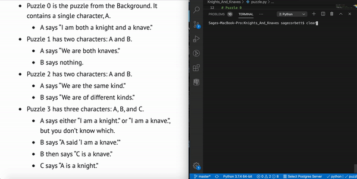

# CS50 Artificial Intelligence

This repo displays all the projects I've done for Harvard's Online Artificial Intelligence course. In this ReadMe below there will be a gif featuring each project along with the project name. In order to see the code just scroll up and click the corresponding folder.

## Degrees 

Degrees is a python program that utilizes a Breadth-first Search to search through over a million actors and movies to find how many degrees one actor is from another.

## Tic Tac Toe

This implementation of the classic game "Tic Tac Toe" allows to play an AI program that uses the MiniMax algorithm to make its decisions for which move to make. You will never win against this program.

## Knights And Knaves

Knights and Knaves uses knowledge engineering to take how a human would solve a problem and convert it into a way that computer could solve it using logic.

Knights And Knaves rules: 
1. A Knight can only and always tell the truth
2. A Knave can only and always tell a lie

